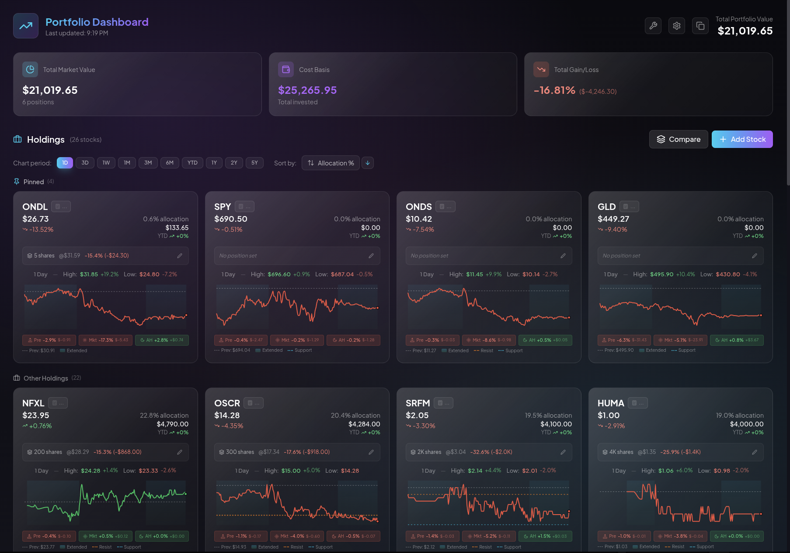
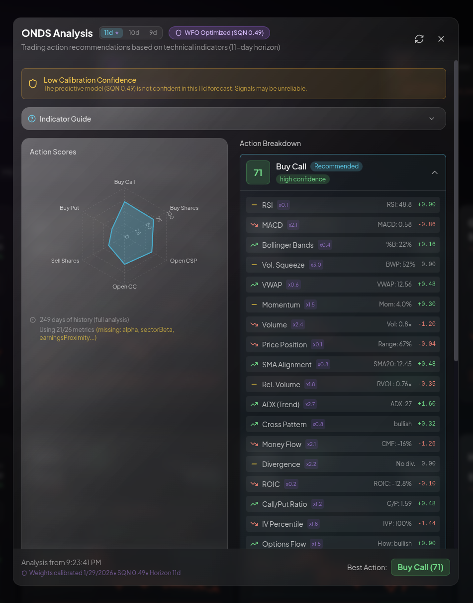
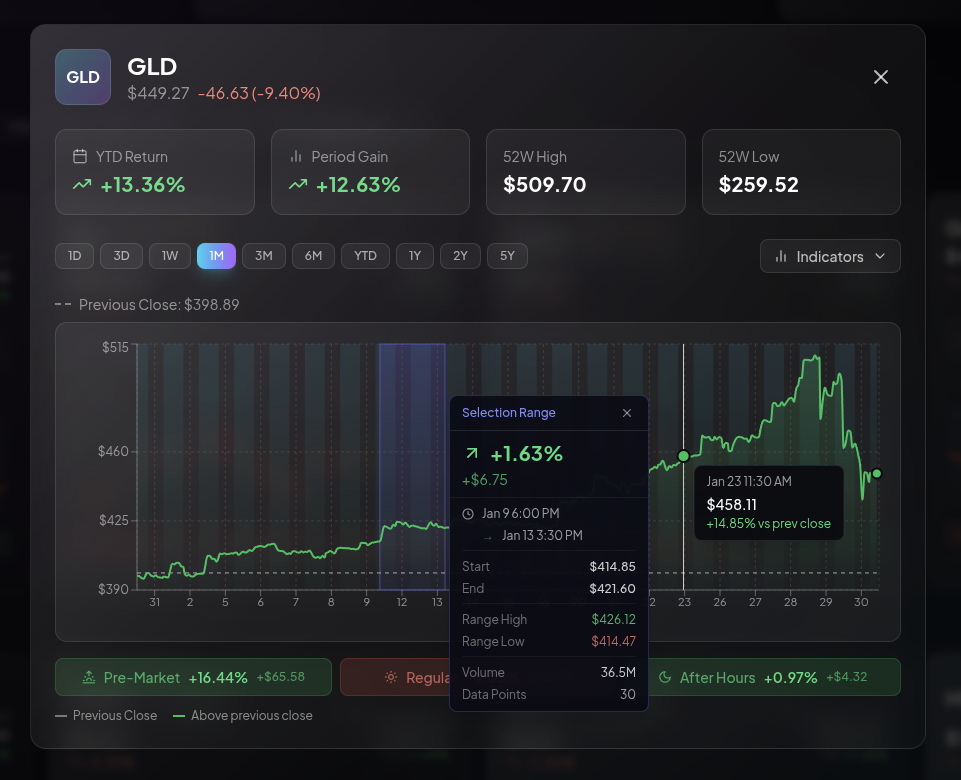
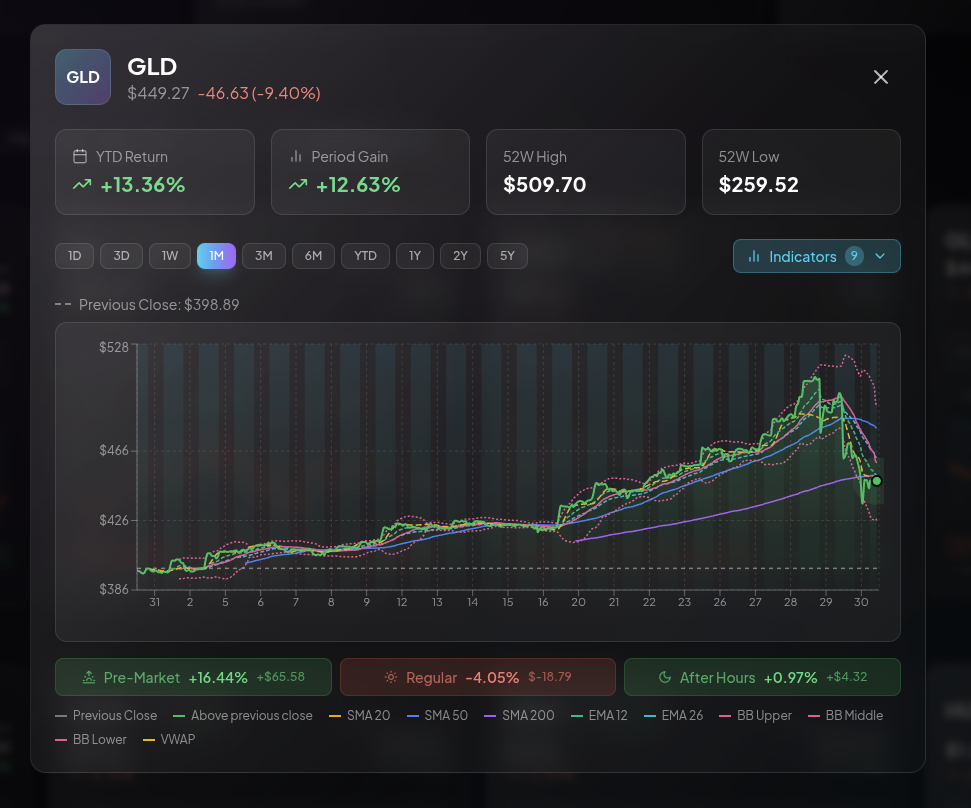
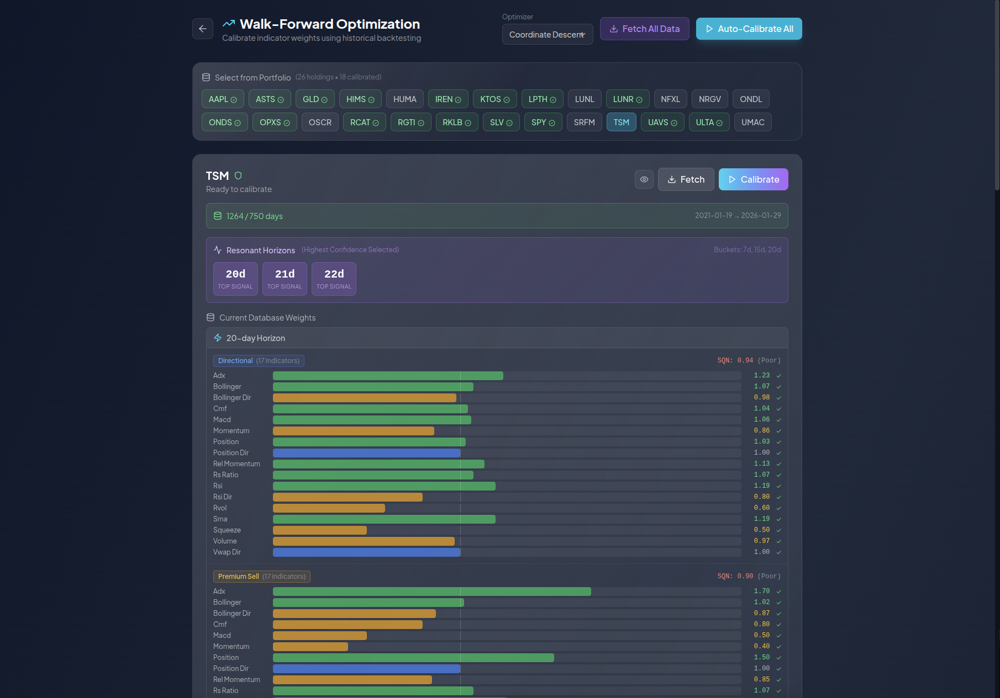
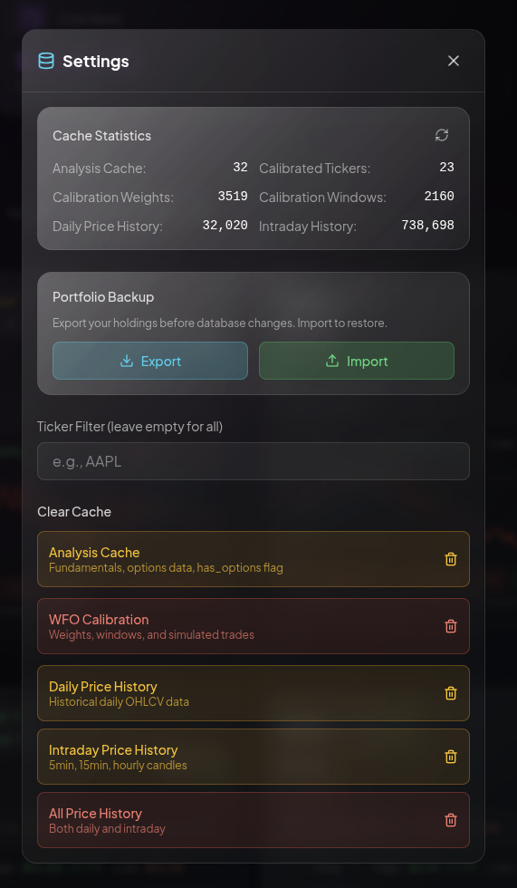
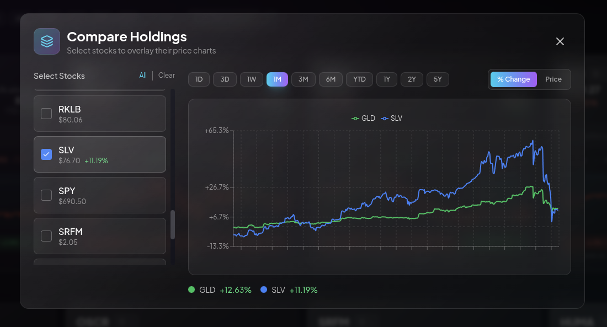
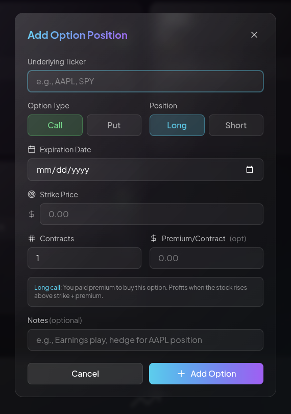

# Stock Analysis Dashboard with Walk-Forward Optimization

A sophisticated algorithmic trading research platform that uses machine learning-inspired techniques to discover which technical indicators actually work for specific stocks and market conditions.

## The Problem

Traditional technical analysis applies the same indicator parameters and interpretations across all stocks and timeframes. RSI < 30 means "oversold" whether you're trading TSLA or JNJ, in a bull market or a crash. This one-size-fits-all approach ignores fundamental differences in stock behavior and market regimes.

**This project addresses that gap.**

## What This Does

Rather than using static technical indicators, this system:

1. **Learns optimal indicator weights per stock** - Discovers that RSI might be a strong signal for AAPL but noise for TSLA
2. **Adapts to different trading horizons** - Swing trading (3 days) and trend following (15 days) require different indicators
3. **Incorporates market regime awareness** - Buying "oversold" stocks in a crash (BEAR_VOLATILE regime) is catastrophic
4. **Optimizes for different strategies** - Directional trades, premium selling (CSP/CC), and premium buying (long options) each have custom objective functions
5. **Uses ensemble scoring** - Combines WFO-calibrated weights with regime rules and consensus signals for robustness

## Screenshots

### Portfolio Dashboard
The main dashboard displays your holdings with real-time prices, action scores, and YTD performance. Each holding shows calibrated recommendations for 6 different trading strategies.



### Stock Analysis Modal
Detailed analysis view with comprehensive technical indicators, volume analysis, and regime-aware action recommendations. Each metric shows its signal strength, weight, and contribution to the final score.



### Interactive Price Charts
Recharts-powered visualizations with technical overlays (SMAs, Bollinger Bands, volume). Supports swing (3-day) and trend (15-day) horizon switching.



### Technical Indicator Breakdown
Deep dive into each indicator's calculation, current value, and interpretation. Shows how RSI, MACD, ADX, CMF, and other indicators contribute to the ensemble score.



### Walk-Forward Optimization Engine
The calibration dashboard runs WFO across multiple stocks and horizons. Real-time progress via Server-Sent Events (SSE) shows optimization status, rolling window metrics, and out-of-sample validation results.



### Portfolio Configuration
Manage portfolio settings, allocations, and view aggregate performance. Supports percentage-based allocations with automatic rebalancing calculations.



### Multi-Stock Comparison
Compare action scores across holdings to identify the best opportunities. Color-coded badges show strength (green = strong signal, red = strong contra-signal).



### Options Integration
Add option holdings (CSP, CC, long calls/puts) with expiration tracking. The system recommends optimal option strategies based on IV percentile, market regime, and technical setup.



## Core Innovation: Walk-Forward Optimization (WFO)

### What is WFO?

Walk-Forward Optimization is a rigorous backtesting methodology that prevents curve-fitting (the #1 killer of algorithmic strategies). Instead of optimizing on your entire dataset and then trading (guaranteed to fail), WFO:

1. **Splits data into rolling windows**: Train on 2 years, test on 6 months, roll forward 3 months
2. **Optimizes on training data only**: Uses Two-Pass Coordinate Descent to find optimal indicator weights
3. **Validates on unseen data**: Tests the calibrated weights on out-of-sample data
4. **Repeats across time**: Multiple windows ensure robustness across different market conditions

### The Optimization Engine

**Two-Pass Coordinate Descent** with advanced overfitting prevention:

```python
# Pass 1: Coarse grid search [0.0, 1.0, 2.0] per indicator
# Pass 2: Fine grid around winner [±0.2, ±0.4]
# Pass 3 (Optional): Learn signal direction (-1 = momentum, +1 = mean-reversion)

# Overfitting Prevention:
- Minimum Improvement Threshold (10%+ improvement required)
- Bayesian Shrinkage (pull weights toward prior based on sample size)
- Bonferroni-Style Penalty (reduce confidence for multiple testing)
- Stability Validation (neighbors must perform within 80% of peak)
```

**Adaptive Window Sizing**: Automatically expands training window until sufficient trades are generated (minimum 30 for statistical significance).

**Strategy-Specific Objective Functions**:
- `directional`: System Quality Number (SQN) - risk-adjusted returns
- `premium_sell`: Win Rate × Average Premium - optimize for consistent income
- `premium_buy`: Expectancy - maximize breakout trade profitability

### Market Regime Classification

6-state regime model prevents catastrophic losses from applying the wrong strategy:

| Regime | Trend | Volatility | Strategy Recommendation |
|--------|-------|------------|-------------------------|
| **BULL_QUIET** | ↗ Up | Low | Trend Following, Buy Calls, Buy Shares |
| **BULL_VOLATILE** | ↗ Up | High | Sell Puts (CSP), Buy Dips, Covered Calls |
| **BEAR_QUIET** | ↘ Down | Low | **Cash, Reduce Exposure** |
| **BEAR_VOLATILE** | ↘ Down | High | **AVOID MEAN-REVERSION** - Falling knives |
| **NEUTRAL_CHOP** | → Flat | Low | Mean Reversion, Iron Condors |
| **NEUTRAL_VOLATILE** | → Flat | High | Wait for Breakout, Straddles |

**Critical Safety Feature**: In BEAR_VOLATILE, mean-reversion indicators (RSI, Bollinger Bands, Price Position) are **zeroed out** to prevent "catching falling knives."

## System Architecture

```
┌─────────────────────────────────────────────────────────────┐
│                     Frontend (React + TypeScript)            │
│  ┌──────────────┐  ┌──────────────┐  ┌──────────────┐      │
│  │ Portfolio    │  │ Calibration  │  │ Analysis     │      │
│  │ Dashboard    │  │ Control      │  │ Modal        │      │
│  └──────┬───────┘  └──────┬───────┘  └──────┬───────┘      │
│         │                  │                  │              │
│         └──────────────────┴──────────────────┘              │
│                            │                                 │
└────────────────────────────┼─────────────────────────────────┘
                             │ REST API + SSE Streaming
┌────────────────────────────┼─────────────────────────────────┐
│                     Backend (FastAPI + Python)               │
│                            │                                 │
│  ┌──────────────────────────▼──────────────────────────┐    │
│  │            Service Layer (Singletons)                │    │
│  │  ┌────────────────┐  ┌────────────────┐            │    │
│  │  │ WFO Optimizer  │  │ Calibration    │            │    │
│  │  │                │  │ Service        │            │    │
│  │  │ • 2-Pass CD    │  │ • SSE Progress │            │    │
│  │  │ • Bayesian     │  │ • ProcessPool  │            │    │
│  │  │ • Stability    │  │ • Job Mgmt     │            │    │
│  │  └────────────────┘  └────────────────┘            │    │
│  │  ┌────────────────┐  ┌────────────────┐            │    │
│  │  │ Stock Fetcher  │  │ Price History  │            │    │
│  │  │ (YahooQuery +  │  │ Service        │            │    │
│  │  │  yfinance)     │  │ (SQLite Cache) │            │    │
│  │  └────────────────┘  └────────────────┘            │    │
│  │  ┌────────────────┐  ┌────────────────┐            │    │
│  │  │ Regime         │  │ Relative       │            │    │
│  │  │ Classifier     │  │ Strength       │            │    │
│  │  └────────────────┘  └────────────────┘            │    │
│  └───────────────────────────────────────────────────────┘    │
│                            │                                 │
│  ┌──────────────────────────▼──────────────────────────┐    │
│  │          SQLAlchemy 2.0 (Async ORM)                 │    │
│  └───────────────────────────────────────────────────────┘    │
│                            │                                 │
│  ┌──────────────────────────▼──────────────────────────┐    │
│  │               SQLite Database                        │    │
│  │  • PriceHistory (Immutable - never refetch)         │    │
│  │  • IntradayPriceHistory (Immutable)                 │    │
│  │  • StockAnalysisCache (15-min TTL)                  │    │
│  │  • CalibrationWeights (WFO Results)                 │    │
│  │  • CalibrationWindow (Rolling Window Metrics)       │    │
│  │  • CalibrationTrade (Trade-Level Analysis)          │    │
│  └───────────────────────────────────────────────────────┘    │
└───────────────────────────────────────────────────────────────┘
```

### Design Philosophy: SQLite First, API Second

**Historical price data is immutable.** Once a day's OHLCV data is stored, it never changes. This drives the entire caching strategy:

```python
# Data Categories:
IMMUTABLE (SQLite forever):
  - Daily history (PriceHistory)
  - Intraday history (IntradayPriceHistory)

SEMI_STALE (15-min TTL):
  - Fundamentals (P/E, ROE, ROIC)
  - Options data (implied volatility, Greeks)

REAL_TIME (Never cached):
  - Current prices
  - Market state
```

**Gap-Fill Strategy**: Always check SQLite first, identify missing date ranges, fetch only what's needed, store immediately.

### Yahoo Finance API Optimization

**Constraints**: Free tier has aggressive rate limiting (~2000 requests/hour with random 429s).

**Solutions**:
1. **Batching**: Use `yf.download([tickers])` for bulk fetches - single API call instead of N
2. **Shared Session**: Reuse connection pools via `yf.Ticker(symbol, session=shared_session)`
3. **Exponential Backoff**: `make_yahoo_request()` wrapper with 1s → 2s → 4s → 8s delays
4. **Worker Limit**: `yfinance_max_workers ≤ 4` to avoid hammering the API
5. **Hybrid Approach**: yahooquery (faster, less reliable) + yfinance (fallback)

## Technical Indicator Suite

**Trend Following**:
- SMA (20, 50, 200) & EMA (12, 26) - Moving averages with cross detection
- MACD - Momentum convergence/divergence
- ADX - Directional movement strength
- Chandelier Exit - ATR-based trailing stop

**Mean Reversion**:
- RSI - Relative strength with hook detection (momentum turning points)
- Bollinger Bands - Volatility bands with squeeze detection
- VWAP & AVWAP - Volume-weighted support/resistance
- Price Position - 52-week range analysis

**Volume Analysis**:
- CMF - Chaikin Money Flow (accumulation/distribution)
- OBV - On-Balance Volume (institutional flow)
- Volume Profile - Price-level volume distribution
- Relative Volume - Current vs 20-day average

**Volatility**:
- Bollinger Squeeze - Contraction predicting breakouts
- ATR - Average True Range for adaptive stops

**Relative Strength** (vs Sector ETF):
- Relative Momentum - Outperformance/underperformance
- RS Ratio - RRG-style quadrant analysis (Leading/Weakening/Lagging/Improving)

**Divergence Detection**:
- Price-Volume Divergence - Smart money behavior
- RSI/MACD Divergence - Momentum shifts

## Ensemble Scoring System

The frontend applies an **ensemble** on top of WFO-calibrated weights:

```typescript
// Layer 1: WFO Base Score (raw indicator weights from backtesting)
const wfoScore = calculateActionScore(action, indicators, weights);

// Layer 2: Regime Rules (block unsafe actions)
if (isActionBlockedByRegime(regime, action)) {
  return 0; // Hard block
}

// Layer 3: Consensus Scoring (agreement across indicators)
const consensusScore = calculateConsensusScore(indicators, action);

// Layer 4: Ensemble Weighting (based on calibration quality)
const ensembleWeights = getEnsembleWeights(sqn); // SQN = calibration confidence
const finalScore =
  ensembleWeights.wfo * wfoScore +
  ensembleWeights.regime * regimeScore +
  ensembleWeights.consensus * consensusScore;
```

**Why this asymmetry?**
- **WFO optimizes signal strength** - Which indicators produce profitable signals
- **Ensemble adds signal confirmation** - Multi-factor validation layer
- **Prevents overfitting** - Don't optimize the entire ensemble, just the core weights

## Key Features

### Portfolio Management
- Mock portfolio with percentage-based allocations
- Real-time price updates (30-second refresh)
- YTD performance tracking
- SMA(200) comparison for trend context

### Action Recommendations
Six trading actions with calibrated scores (0-100):
- **Buy Shares / Sell Shares** - Directional equity trades
- **Open CSP (Cash-Secured Put)** - Premium selling for income
- **Open CC (Covered Call)** - Enhance returns on holdings
- **Buy Call / Buy Put** - Leveraged directional bets

### Calibration Dashboard
- Multi-stock, multi-horizon calibration
- Server-Sent Events (SSE) for real-time progress
- Rolling window metrics visualization
- Trade-level analysis with regime tagging
- Export to CSV for external analysis

### Data Caching & Performance
- SQLite-based price cache (immutable historical data)
- React Context for frontend caching (5-minute TTL)
- Lazy-loading for stock analysis (only fetch when needed)
- Singleton service pattern (shared database sessions)

## Tech Stack

| Layer | Technology | Why |
|-------|-----------|-----|
| **Backend** | FastAPI + Python 3.11 | Async-native, auto-generated docs, type safety |
| **Database** | SQLite + SQLAlchemy 2.0 | Serverless, async ORM, perfect for local-first |
| **Stock Data** | yahooquery + yfinance | Free, no API key, hybrid approach for reliability |
| **Optimization** | NumPy + Pandas | Vectorized operations, fast backtesting |
| **Frontend** | React 18 + TypeScript | Modern hooks, type safety, component reuse |
| **Styling** | Tailwind CSS | Utility-first, rapid development, glassmorphism |
| **Charts** | Recharts | React-native, responsive, declarative API |
| **Container** | Docker Compose | Reproducible environment, easy deployment |

## Engineering Highlights

### 1. Two-Pass Coordinate Descent with Overfitting Prevention

The optimizer includes multiple safeguards against overfitting:

```python
# Bayesian Shrinkage - Pull toward prior based on sample size
posterior = (prior_strength * default + n_trades * optimal) / (prior_strength + n_trades)

# Minimum Improvement - Only accept 10%+ improvement over baseline
if (optimal_score - default_score) / default_score < 0.10:
    revert_to_default()

# Stability Validation - Neighbors must perform within 80% of peak
for neighbor in get_neighbors(optimal_weight):
    assert neighbor_score >= optimal_score * 0.8

# Multiple Testing Correction - Bonferroni-style penalty
corrected_score = optimal_score * (1 - 0.005 * num_tests)
```

### 2. Adaptive Window Sizing

Stocks have different volatility profiles. NVDA generates 100+ trades in 6 months, while KO might generate 10. The adaptive window expands training data until minimum significance is reached:

```python
def get_adaptive_window(df, weights, horizon, min_trades=30):
    """Expand window until we hit min_trades."""
    window_days = 126  # Start at 6 months
    while window_days <= 504:  # Max 2 years
        result = fast_simulate(df.tail(window_days), weights, horizon)
        if result.total_trades >= min_trades:
            return window_days, result.total_trades
        window_days += 21  # Expand by 1 month
    raise InsufficientVolatilityError()
```

### 3. Regime-Aware Signal Zeroing

In BEAR_VOLATILE regime, the simulator **zeros out** mean-reversion signals:

```python
# Backend (wfo_simulator.py)
if regime == 'BEAR_VOLATILE':
    regime_adjustments = {
        'rsi': 0.0,        # Oversold = falling knife
        'bollinger': 0.0,  # Lower band = no support
        'position': 0.0,   # "Cheap" = not support
    }

# Frontend (stockScoring.ts)
if (isActionBlockedByRegime(regime, action)) {
    return { ...score, totalScore: 0 };  // Hard block
}
```

This prevents the catastrophic "buy the dip" trap during market crashes.

### 4. SQLite-First Caching Strategy

**Gap-Fill Example**:
```python
# 1. Check what we have
existing = await db.execute(
    select(PriceHistory)
    .where(PriceHistory.ticker == 'AAPL')
    .order_by(PriceHistory.date)
)

# 2. Identify gaps
last_date = existing[-1].date if existing else None
missing_days = (today - last_date).days if last_date else 1000

# 3. Fetch ONLY missing data
if missing_days > 0:
    new_data = yf.Ticker('AAPL').history(start=last_date)
    await bulk_insert(new_data)  # SQLite batch insert

# 4. Never re-fetch historical data
```

### 5. ProcessPoolExecutor for CPU-Bound Work

The calibration service uses `ProcessPoolExecutor` to bypass Python's GIL:

```python
# Spawn worker processes for parallel optimization
pool = ProcessPoolExecutor(max_workers=cpu_count() - 1)

# Each ticker runs in separate process
futures = [
    pool.submit(optimize_for_ticker, df, ticker, horizon)
    for ticker in tickers
]

# Gather results asynchronously (non-blocking)
results = await asyncio.gather(*[
    loop.run_in_executor(None, future.result)
    for future in futures
])
```

### 6. Hybrid Optimizer Options

Three optimization algorithms with tradeoffs:

| Algorithm | Speed | Global Optimum | Interaction Detection |
|-----------|-------|----------------|----------------------|
| **Coordinate Descent** | Fast (baseline) | No (greedy) | No |
| **Differential Evolution** | Slow (5-10x) | Yes | Yes |
| **Hybrid** (default) | Medium (3x) | Yes | Yes |

Hybrid mode: DE for global search → CD for local refinement.

## Quick Start

### Prerequisites
- Docker & Docker Compose
- 8GB RAM minimum (16GB recommended for multi-stock calibration)
- 2GB disk space for SQLite database

### Launch

```bash
# Clone and start
git clone https://github.com/kfilanowski/Stock-Dashboard.git
cd stock-dashboard
docker-compose up --build

# Access
Frontend: http://localhost:3000
API Docs: http://localhost:8000/docs
SQLite Browser: http://localhost:8001
```

### First-Time Setup

1. **Add Holdings**: Click "Add Stock", enter ticker (e.g., `AAPL`) and allocation percentage
2. **Fetch History**: Backend automatically fetches 3 years of price data on first request
3. **Run Calibration**: Navigate to Calibration page, select tickers, click "Start Calibration"
4. **View Analysis**: Click chart icon on any holding to see detailed analysis with calibrated weights

## Learning Journey

This project was built with dual goals:
1. **Build a predictive trading system** using algorithmic techniques
2. **Learn technical analysis** by implementing indicators

### Key Learnings

**What Works**:
- RSI/Bollinger work better for mean-reversion in range-bound markets (NEUTRAL_CHOP)
- MACD/ADX excel in trending environments (BULL_QUIET, BEAR_QUIET)
- Volume indicators (CMF, OBV) provide early warnings before price moves
- Relative Strength vs sector ETF adds significant alpha
- Market regime is THE most important filter - prevents catastrophic losses

**What Doesn't Work**:
- Static indicator parameters across all stocks (one-size-fits-all approach)
- Ignoring volatility when timing entries (Bollinger Squeeze is critical)
- Fighting the trend (buying "oversold" in downtrends = catching knives)
- Over-optimizing on small sample sizes (need 30+ trades minimum)

**Overfitting Traps**:
- Testing many parameter combinations → random chance winners
- Optimizing on the same data you test on → guaranteed failure
- Ignoring transaction costs → profitable backtest, losing live trading
- Solution: Walk-Forward Optimization + Bayesian Shrinkage + Multiple Testing Correction

## Database Schema

**PriceHistory** (Immutable - Never Refetch):
```sql
CREATE TABLE price_history (
    id INTEGER PRIMARY KEY,
    ticker VARCHAR(10) NOT NULL,
    date DATE NOT NULL,
    open REAL, high REAL, low REAL, close REAL, volume INTEGER,
    UNIQUE(ticker, date)
);
CREATE INDEX idx_ticker_date ON price_history(ticker, date);
```

**CalibrationWeights** (WFO Results):
```sql
CREATE TABLE calibration_weights (
    id INTEGER PRIMARY KEY,
    ticker VARCHAR(10) NOT NULL,
    horizon INTEGER NOT NULL,
    strategy_class VARCHAR(20),  -- 'directional', 'premium_sell', etc.
    weights JSON NOT NULL,        -- Serialized weight dict
    train_sqn REAL,
    total_trades INTEGER,
    optimized_at TIMESTAMP,
    reduced_confidence BOOLEAN,
    UNIQUE(ticker, horizon, strategy_class)
);
```

**CalibrationWindow** (Rolling Window Metrics):
```sql
CREATE TABLE calibration_window (
    id INTEGER PRIMARY KEY,
    calibration_id INTEGER REFERENCES calibration_weights(id),
    train_start DATE, train_end DATE,
    test_start DATE, test_end DATE,
    window_days INTEGER,
    train_sqn REAL, test_sqn REAL, test_gross_sqn REAL,
    trades_count INTEGER,
    expectancy REAL
);
```

**CalibrationTrade** (Trade-Level Analysis):
```sql
CREATE TABLE calibration_trade (
    id INTEGER PRIMARY KEY,
    window_id INTEGER REFERENCES calibration_window(id),
    entry_date DATE, exit_date DATE,
    entry_price REAL, exit_price REAL,
    position INTEGER,  -- 1 (long), -1 (short), 0 (cash)
    return_pct REAL,
    market_regime VARCHAR(20)  -- BULL_QUIET, BEAR_VOLATILE, etc.
);
```

## Configuration

Key settings in `backend/app/config.py`:

```python
# Yahoo Finance Rate Limiting
yfinance_max_workers = 4           # Concurrent API requests
request_timeout = 10               # Seconds per request
exponential_backoff = [1, 2, 4, 8] # Retry delays

# WFO Parameters
train_window_months = 24           # 2 years training data
test_window_months = 6             # 6 months validation
roll_step_months = 3               # Quarterly rolling
min_trades_for_significance = 30   # Statistical threshold
full_confidence_trades = 30        # Flag reduced confidence below this

# Caching TTLs
stock_analysis_cache_ttl = 900     # 15 minutes (semi-stale data)
# Historical data never expires (immutable)
```

## License

MIT License - See LICENSE file for details.

## Acknowledgments

- **Walk-Forward Optimization** concept from [Pardo's "The Evaluation and Optimization of Trading Strategies"](https://www.amazon.com/Evaluation-Optimization-Trading-Strategies/dp/0470128011)
- **System Quality Number (SQN)** from [Van Tharp's "Trade Your Way to Financial Freedom"](https://www.vantharp.com/)
- **Market Regime Classification** inspired by [Keller & Putten's "Generalized Momentum and Timing"](https://papers.ssrn.com/sol3/papers.cfm?abstract_id=2606884)
- **Technical Analysis** fundamentals from [Murphy's "Technical Analysis of the Financial Markets"](https://www.amazon.com/Technical-Analysis-Financial-Markets-Comprehensive/dp/0735200661)

---

**Disclaimer**: This software is for educational and research purposes only. Not financial advice. Past performance does not guarantee future results. Trade at your own risk.
